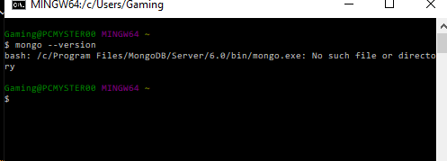

# module-18-socialnetworkapi
Starting off i tried to get my database up in running i went through the installation 
process many times talked wit hjason the ta and even asked bcs for help and ive been 
stumped ever since i tried setting up the user db, model and routes, but without being able to establish
 a connection i havent been able to get far.

